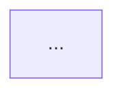

# Stubs Mermaid Architecture Diagrams & Documentation Sync

Use `stubs diagram` to generate, preview, and synchronize Mermaid diagrams across your architectural documentation.

## Commands

```bash
# Output top-down layer-grouped architecture diagram
stubs diagram

# Output domain-grouped architecture diagram
stubs diagram --group-by domain

# Trace sequence call flow from an entrypoint module
stubs diagram src/cli/router.ts --type sequence

# Generate focused neighborhood slice around a specific module
stubs diagram src/graph/engine.ts --type slice

# Automatically synchronize Mermaid block into context-map.md
stubs diagram --sync knowledge/architecture/context-map.md

# Write diagram to specific file
stubs diagram --output docs/architecture.md
```

## Documentation Sync Markers

To enable automated syncing into markdown documentation, include the following markers:

```markdown
<!-- BEGIN STUBS DIAGRAM -->

<!-- END STUBS DIAGRAM -->
```
